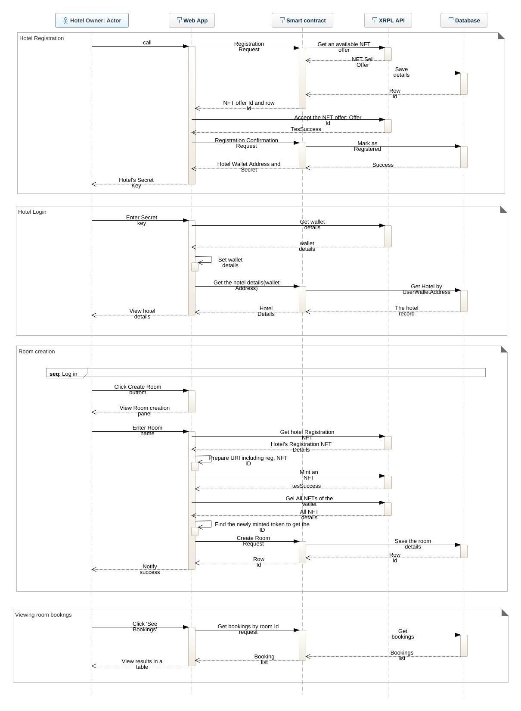
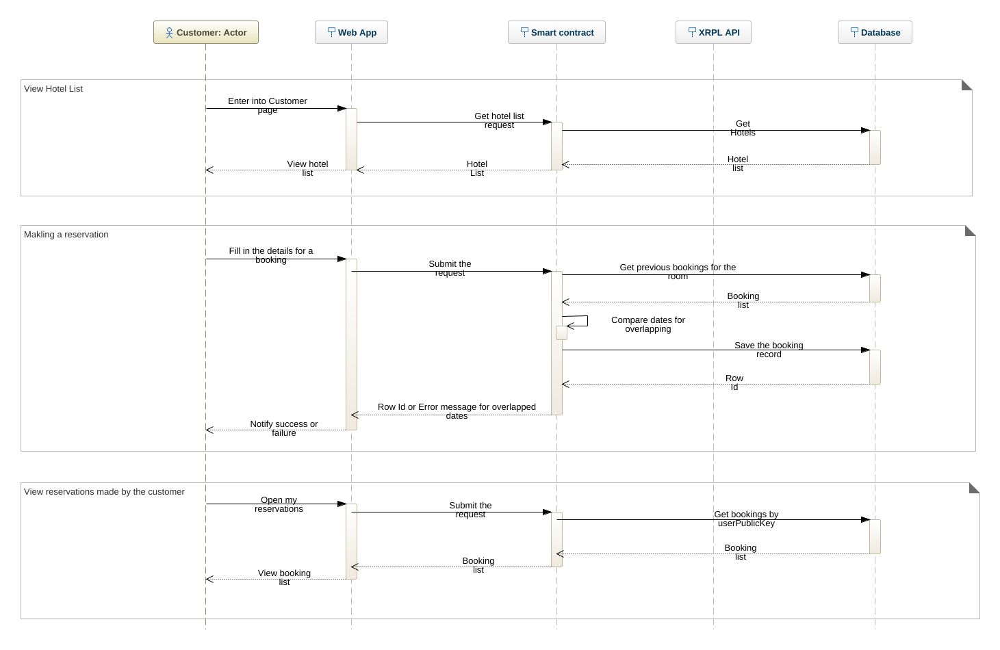

# Voyage Lanka [](https://app.netlify.com/sites/voyagelanka/deploys)

This is a decentralized hotel booking system, running on Evernode clusters, integrating with XRPL.
<br>
Visit: [voyagelanka.netlify.app](https://voyagelanka.netlify.app/)


# Introduction
This repository contains two projects,
<br>
1. [Hotel booking client application](#1-hotel-booking-smart-contract)
2. [Hotel booking smart contract](#2-hotel-booking-client-application)

The users can interact with the smart contract through the client application which is a web application developed with React.js.
The smart contract can run on the Evernode platform which has been built on the XRP Ledger.


## Overview Diagrams

### Hotel Data flow



### Customer data flow



# 1. Hotel Booking Smart Contract

This is a nodeJS application that is capable of handling requests coming from the client web application, running the relevant logic, connecting with the XRP ledger and an internal database and sending the responses back to the web application.
We use web sockets for communication between the client app and the contract.

The smart contract has its own XRPL wallet which is used to mint NFTs for registration and to do future transactions. There are pre-minted Hotel registration NFTs and sell offers for them in the wallet.

## The project structure
The project structure is similar to a typical NodeJS application.
```
booking_contract
├── dist
│   ├── build
│   ├── hp.cfg.override
│   ├── index.js
│   └── lib
├── package.json
├── package-lock.json
├── README.md
└── src
    ├── booking_contract.js
    ├── core_services
    │   ├── dbService.js
    │   ├── defaults.js
    │   ├── event-emitter.js
    │   ├── evernode-common.js
    │   ├── sqlite-handler.js
    │   ├── transaction-helper.js
    │   ├── xrpl-account.js
    │   ├── xrpl-api.js
    │   └── xrpl-common.js
    ├── services
    │   ├── api-service.js
    │   └── transaction-service.js
    └── settings.json
```

The **_core-services_** folder contains the helper-service classes to connect with the SQlite database and XRP ledger.

The **_booking_contract.js_** file is the starting point of the contract and during every round of the consensus, this smart contract runs from the beginning.
```javascript
const HotPocket = require("hotpocket-nodejs-contract");
const { ApiService } = require('./services/api-service');
const { DbService } = require("./core_services/dbService");

const booking_contract = async (ctx) => {
    console.log('Hotel Reservation Smart Contract is running.');
    const isReadOnly = ctx.readonly;

    const apiService = new ApiService();
    await DbService.initializeDatabase();

    for (const user of ctx.users.list()) {

        // Loop through inputs sent by each user.
        for (const input of user.inputs) {

            // Read the data buffer sent by user (this can be any kind of data like string, json or binary data).
            const buf = await ctx.users.read(input);

            // Let's assume all data buffers for this contract are JSON.
            const message = JSON.parse(buf);

            // Pass the JSON message to our application logic component.
            await apiService.handleRequest(user, message, isReadOnly);

        }

    }
}


const hpc = new HotPocket.Contract();
hpc.init(booking_contract);
```
In this application, we transfer data as json objects. Once a request comes from a user to the contract, we catch the input inside a _while_ loop and parsed json object is then passed to the _apiService_ class for further process.

ApiService class in api-service.js file acts as a controller class in a usual backend API project.
```javascript
 export class ApiService {

  dbPath = settings.dbPath;

  constructor() {
    this.db = new SqliteDatabase(this.dbPath);
  }

  async handleRequest(user, message, isReadOnly) {
      
    let result = {};

    if (message.type == constants.RequestTypes.HOTEL) {                                     //------------------- Hotel Related Api ------------------------------------
      result = await new HotelService(message).handleRequest();
    }
    else if (message.type == constants.RequestTypes.ROOM) {                                             //--------------------- Room related Api -----------------------
      result = await new RoomService(message).handleRequest();
    }
    else if (message.type == constants.RequestTypes.CUSTOMER) {                                            //------------------- Customer related Api --------------------------------------
      result = await new CustomerService(message).handleRequest();
    }
    else if (message.type == constants.RequestTypes.RESERVATION) {                                        //-------------------- Reservation related Api-------------------------
      result = await new ReservationService(message).handleRequest();
    }


    if(isReadOnly){
      await this.sendOutput(user, result);
    } else {
      await this.sendOutput(user, message.promiseId ? {promiseId: message.promiseId, ...result} : result);
    }
  }

  sendOutput = async (user, response) => {
    await user.send(response);
  }
```

In the json message we send a field named 'type' which is used to identify the request type. According to the message type, we pass the request to the relevant method for processing.

In **_transaction-service.js_** file, we can find several methods.
<br>
The constructor method is used to initialize the connections to the XRPL and database.
```javascript
constructor(message) {
        this.#message = message;
        this.#xrpl = new XrplApi('wss://hooks-testnet-v2.xrpl-labs.com');
        this.#contractAcc = new XrplAccount(settings.contractWalletAddress, settings.contractWalletSecret, { xrplApi: this.#xrpl });
        this.#db = new SqliteDatabase(this.#dbPath);
    }
```
- requestHotelRegistration()<br>
  In this method, once a hotel registration request comes from the client app with hotel details, the details are saved in the database first. And an available NFTSellOffer ID and the DB record ID are sent to the client app.

- confirmHotelRegistration()<br>
  Once the cliet app accepts the NFTSellOffer successfully, this method is called and this marks the hotel as a suceessfuly registered hotel in the DB.

The contract has its own XRPL wallet which is used to mint Hotel Registration tokens and sell them. For now, we use the default XRP as the currency for the transactions with hotel wallets.

The **_sqlite-handler.js_** is used to execute database queries.
We use some methods written in xrpl helper class files for now bt the rest will be used in future developments of the project.

<br><br>

# 2. Hotel Booking Client Application
This is a react.js web application. As this project has been developed as a proof of concept, we have designed some basic functions only.
1. A hotel owner can register his/her hotel to our hotel booking system.
2. A hotel owner can log in with his/her hotel's XRPL secret key.
3. A hotel owner can create rooms.
4. A hotel owner can view the bookings made by customers for each room separately.
5. A customer can view the registered hotel list.
6. A customer can view the rooms and make reservations for certain periods.
7. A customer can view the reservations made by him/her.

This application connects with both the smart contract and the XRP Ledger.

## The project structure
This is the simple project structure of the application.
Within **index.html**, we have put the xrpl script for the communication with xrpl. <br>
` <script src="https://unpkg.com/xrpl@2.2.1/build/xrpl-latest-min.js"></script>` <br>
<br>
There are two service files. **_contract-service.js_** file is used for communication with the smart contract. There, we can submit inputs and subscribe to the output events of the smart contract.
<br>
We have integrated the xrpl connections within the **_hotel-service.js_** file. First, we get the xrpl module to this file as below.
```javascript
const xrpl = window.xrpl;
```
Then we get an xrpl client object in the constructor.
```javascript
  constructor() {
    this.#xrplClient = new xrpl.Client(this.#xrplServerURL);
  }
```

There are several both private and public methods within the class. Some of them are briefly explained. For more details, please refer to the code.
- async createNewUserWallet()<br>
  This method is called on hotel registration to create a new XRPL wallet and fund it with XRP.
  ```javascript
  async createNewUserWallet() {
    if (this.userWallet.address == null || this.userWallet.secret == null) {
      try {
        await this.#xrplClient.connect();

        const new_wallet = xrpl.Wallet.generate();
        await this.#getFunded(new_wallet.address, 300);
        this.userWallet.balance = await this.#xrplClient.getXrpBalance(
          new_wallet.address
        );
        this.userWallet.address = new_wallet.address;
        this.userWallet.secret = new_wallet.seed;
        this.userWallet.publicKey = new_wallet.publicKey;
        this.userWallet.privateKey = new_wallet.privateKey;
        console.log(new_wallet);
      } catch (error) {
        console.log(`Error in account creation: ${error}`);
        throw `Error in account creation: ${error}`;
      } finally {
        this.#xrplClient.disconnect();
      }
    }
    return {
      walletAddress: this.userWallet.address,
      walletSecret: this.userWallet.secret,
    };
  }
  ```
- async #getFunded(toAccountAddress, xrpAmount, fromAccountSecret = fundWalletSecret) <br>
  This methods is used to fund wallets with XRP.
  ```javascript
    async #getFunded(toAccountAddress, xrpAmount, fromAccountSecret = fundWalletSecret) {
        const _wallet = xrpl.Wallet.fromSeed(fromAccountSecret);
        const prepared = await this.#xrplClient.autofill({
          TransactionType: "Payment",
          Account: fundWalletAddress,
          Amount: xrpl.xrpToDrops(xrpAmount.toString()),
          Destination: toAccountAddress,
        });

        const signed = _wallet.sign(prepared);
        const tx = await this.#xrplClient.submitAndWait(signed.tx_blob);
        console.log("Transaction result:", tx.result.meta.TransactionResult);
    }
  ```

- async setUserWallet(seed, isHotel = false)<br>
  This method is called when a hotel owner logs in with his hotel's XRPL secret key. Here, we check whether the hotel wallet derived from the secret, has the hotel Registration NFT, which must be issued by the hotel booking contract's XRPL wallet with a specific URI.
  ```javascript
  async setUserWallet(seed, isHotel = false) {
    try {
      await this.#xrplClient.connect();

      const the_wallet = xrpl.Wallet.fromSeed(seed);

      if (isHotel) {
        const regNfts = await this.#getNfts(
          the_wallet.address,
          this.#registrationURI,
          contractWalletAddress
        );

        if (regNfts?.length == 0) {
          throw "This is not a registered hotel. Please register.";
        }
      }

      this.userWallet.balance = await this.#xrplClient.getXrpBalance(
        the_wallet.address
      );
      this.userWallet.address = the_wallet.address;
      this.userWallet.secret = the_wallet.seed;
      this.userWallet.publicKey = the_wallet.publicKey;
      this.userWallet.privateKey = the_wallet.privateKey;

      if (isHotel) {
        const msg = {
          type: "getHotels",
          filters: {
            HotelWalletAddress: this.userWallet.address,
          },
        };
        const result = await this.contractService.submitInputToContract(msg);
        if (result.hotels.length > 0) {
          this.#hotelId = result.hotels[0].Id;
        }
      }
    } catch (error) {
      console.log(`Error in fetching account: ${error}`);
      throw `Error in fetching account: ${error}`;
    } finally {
      this.#xrplClient.disconnect();
    }
  }
  ```

- async #acceptHotelRegistrationOffer(regObj) <br>
  This method is a private method and is called in hotel registration process. Once the web application receives a NFTSellOffer ID, this method accepts the offer to buy the registration NFT. After the successful buying, the contract is notified about this.
  ```javascript
  async #acceptHotelRegistrationOffer(regObj) {
    const messageType = "hotelRegistration";
    const messageCommand = "hotelRegConfirm";
    let result;
    try {
      // Connect to xrpl to accept the offer
      await this.#xrplClient.connect();

      const prepared = await this.#xrplClient.autofill({
        TransactionType: "NFTokenAcceptOffer",
        Account: this.userWallet.address,
        NFTokenSellOffer: regObj.offerId,
        Memos: [],
      });

      const wallet = xrpl.Wallet.fromSeed(this.userWallet.secret);
      const signed = wallet.sign(prepared);
      const tx = await this.#xrplClient.submitAndWait(signed.tx_blob);

      if (tx.result.meta.TransactionResult !== "tesSUCCESS") {
        throw "Hotel Registration offer not accepted successfully.";
      }

      const submitObj = {
        type: messageType,
        command: messageCommand,
        data: {
          hotelWalletAddress: this.userWallet.address,
          rowId: regObj.rowId,
        },
      };
      result = await this.contractService.submitInputToContract(submitObj);
    } catch (error) {
      throw error;
    } finally {
      this.#xrplClient.disconnect();
    }

    return result;
  }
  ```

  It's recommended to go through each method in this file to get a good idea of the implementation.